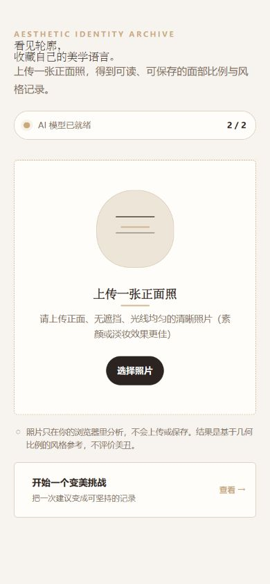

# 美学身份卡 · Face Style Notes

一款面向年轻女性的移动端面部比例分析与变美行动网页。上传一张正面照后，页面会把面部轮廓与比例整理成可读、可收藏、可分享的“美学身份卡”，并可继续创建变美挑战、完成打卡和记录前后对比。

[在线体验](https://najeebjb724-star.github.io/face-style-notes/) · [查看当前源码分支](https://github.com/najeebjb724-star/face-style-notes/tree/codex/aesthetic-identity-card-ui)



## 目前可以体验什么

- 照片质量检查：提示角度、清晰度、亮度和人脸大小问题。
- 参考级继续分析：照片不完全合格时，用户仍可主动选择继续，并看到可信度提示。
- 可读面部数据：将三庭、眼距、轮廓和六维特征转成更容易理解的描述。
- 美学身份卡：以杂志与收藏卡风格呈现结果，可保存或通过系统分享。
- 变美挑战：模板优先、可选自定义，支持打卡、提醒日历文件、前后照片对比和挑战海报。

## 隐私与结果边界

用户选择的照片在浏览器本地处理，不会发送到本项目服务器。挑战记录和可选对比照片可能保存在当前浏览器的本地存储中。GitHub Pages 与第三方 CDN 会产生加载页面、脚本、字体或模型所需的常规网络请求，但不会上传用户选择的照片。完整说明见 [PRIVACY.md](PRIVACY.md)。

身份卡是基于照片与几何比例的风格参考，不评价美丑，不构成医疗、健康或人格判断。拍摄角度、光线、镜头畸变、表情和启发式规则都会影响结果。

## 本地运行

项目保持单文件应用结构，无需安装构建依赖。由于浏览器对 `file://` 页面和 CDN 的限制不同，推荐在项目目录启动本地静态服务器：

```bash
python -m http.server 8000
```

然后访问 `http://127.0.0.1:8000/`。首次打开需要联网加载 Tailwind CSS、Face-API.js、html2canvas 和 Face-API.js 模型文件。

## 技术构成

- 单文件 HTML、CSS 与原生 JavaScript
- Tailwind CSS CDN
- Face-API.js 0.22.2 与 68 点关键点模型
- html2canvas 1.4.1
- 浏览器 localStorage、IndexedDB、Web Share 与日历 `.ics` 文件

## 测试

需要 Node.js 18 或更高版本：

```bash
node --test tests/*.test.cjs
```

## 当前限制

- 第一次打开必须联网加载 CDN 依赖和模型，弱网下等待时间会更长。
- 页面不是离线应用，也没有账号与云同步；清理浏览器数据或更换设备后，本地挑战记录可能消失。
- 面部分析结果依赖单张照片，不等同于真人动态观察或专业意见。
- 当前是验证核心链路的网页版 MVP，微信登录、云数据库、订阅消息和小程序码将在迁移到微信小程序时另行设计。

## License

本项目采用 [MIT License](LICENSE)。
